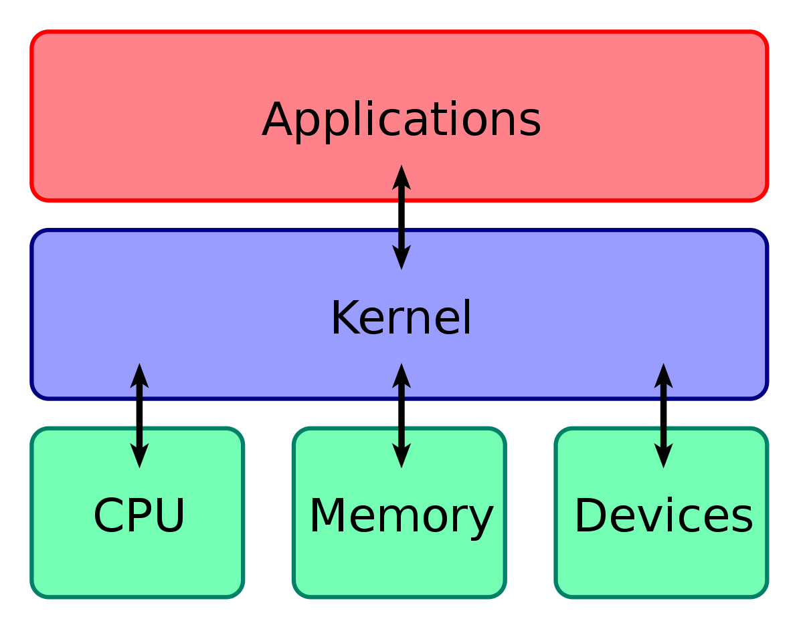

# Detailed Design

Shivani and Jordyn

## 2.1 - Detailed list of Linux modules that will be modified/affected

NA

## 2.2 – Detailed list of any new modules that you will produce [or 'Not Applicable' if there are none]

New system call named freeport. When freeport is called it will let the user know of a specific port that is available.

## 2.3 – Class diagram showing affected modules [and any new modules] and how they related to one another

We will be modifying in the kernel layer.

<!--  -->

## 2.4 – List or table of explanations of all command line options that will be implemented

NA
